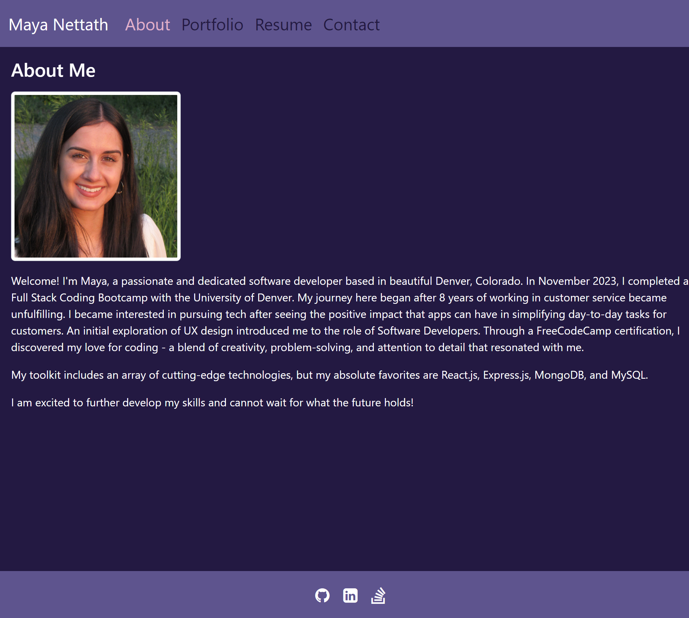

# react-portfolio

## Description

I created this portfolio in order to display my work to potential employers. Working on this portfolio helped amplify my understanding of React.js. I also got the chance to refamiliarize myself with Bootstrap after not using for awhile. I plan to use Bootstrap to redesign some of my previous projects. This portfolio was also displayed using Netlify, a deployment platform I have never used. A challenge that I had while working on this portfolio was getting the images to render through the deployed link. To solve this, I had to import my images into the files and use curly brackets in the src. Using the images' relative paths only worked when I was using localhost:3000 to test. I learned so much while working on this portfolio! 

## Installation

N/A

## Usage

Users will automatically be shown the About page. They can click on the tabs Portfolio, Resume, and Contact. The portfolio page features six deployed projects of mine. Users can click the buttons to navigate to either the deployed page or GitHub repo. On the Resume page, users can click to download my resume. The Contact page, features a form where users can leave me their name, email, and a message. These 3 fields are all required and will stop the user from submitting the form until all fields are filled out. The form also will validate that the user entered a valid email format. In the footer, the user can click the icons to navigate to my GitHub, Linkedin, and Stack Overflow profiles. 

## Credits

N/A

## License

N/A

